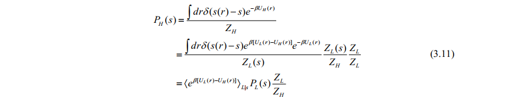
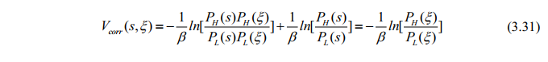
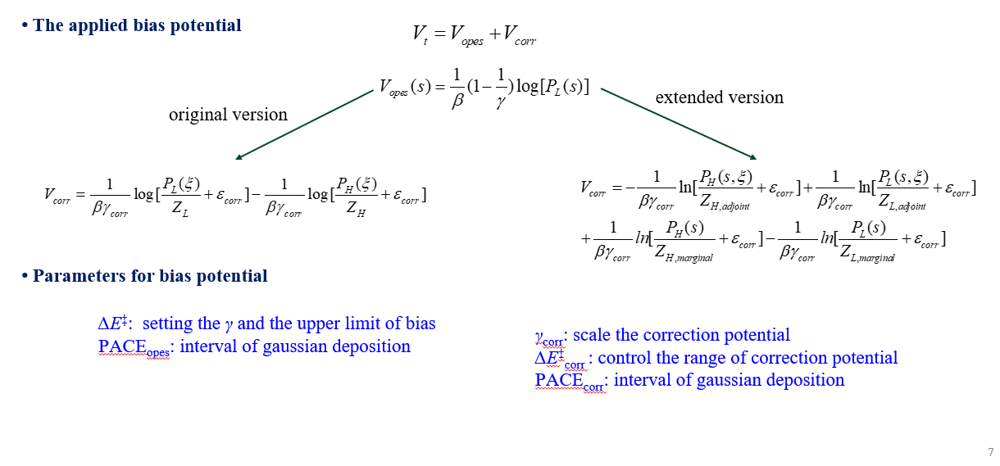
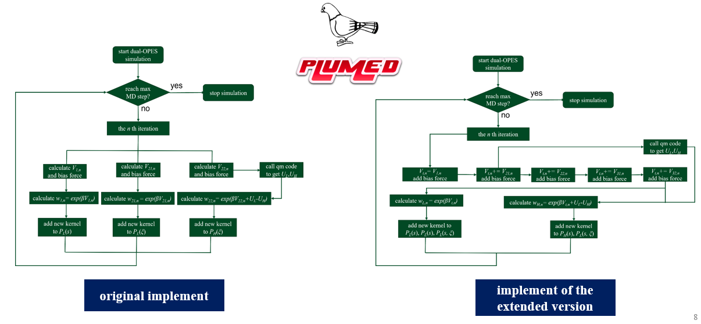
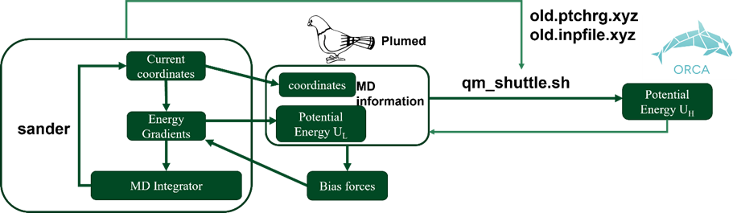

# Summary

**Dual-Level OPES is a free energy calculation method combines the ideas of OPES and thermodynamics perturbation **

This repository contains the modified Plumed code, scripts and example input files to run the dual-level OPES simulations.

**old_version** directory contains the original implement of this method (modified code of the OPES module in Plumed **src/OPESmetad_dual2.cpp**) and corresponding input files and scripts for the glycine in water simulation (**examples** directory, containing amber prmtop and rst file for this system,   a script to call Orca calculating the low and high-level energy each PACE~corr~ step, and plumed.dat for dual-level OPES, the amber needed .tpl files for low and high-level QM/MM calculation——containing keywords for Orca qm computation).  In the glycine example, during the simulation, a normal OPES bias was applied to the proton transfer reaction coordinate, as well as a probability distribution correction potential on six coordination numbers associated with the glycine-water hydrogen bonds. Therefore, there is a OPES block in the plumed.dat (corresponding to the V_1 part), and two correction potential blocks  (corresponding to the V_21 and V_22 parts, see eq 24 in our paper). plumed.dat is compatible with the case when gamma_corr is set to 1, plumed.dat.gamma is for using a gamma_corr with other value larger than 1 (in the correction potential part, BIASFACTOR keyword was used to set gamma_corr). The original implement is a little bit confusing, and it has some limitations, therefore we made a improved version.

**src** directory contains the new implement of the Dual-Level OPES method. **src/opes_dual_for_pesmd** for Dual-Level OPES running on an EVB-model PES, and **src/opes_dual** for realistic systems (QM/MM MD with amber and Orca). In **src/opes_dual_for_pesmd**, calc_H0H1.h and calc_H0H1.cpp are for model PES computation; OPESmetad_dual2_formula1.cpp is the old implement and OPESmetad_dual2.cpp is the extended version. In **src/opes_dual**, OPESmetad_dual2.cpp is the new implement, qm_shuttle.sh.pre is a shell script template to call Orca during the simulation. The OPESmetad.cpp in **src/opes** was also modified to add an option that using the total bias potential to reweight the kernels.

In the extended version, the correction potential contains two parts depending on the marginal distribution of  reaction coordinate (s) and the reaction coordinate (s)-correction variable ($\xi$) adjoint distribution respectively. They both can be split into the low-level-probability-distribution-depended term and  the high-level term. Therefore in the extended version, correction potential is split into 4 terms. If s is independent of $\xi$, the 4 terms reduce to the 2 marginal terms in the original formation. As shown in **examples/glycine/plumed.dat**, there are 4 blocks for correction potential after OPES block (the OPES block should be put first). When  USE_TOT_BIAS was set for each block, the total bias potential (OPES bias plus correction potential) will be use for reweighing the kernels, which may help to match the low-level and high-level probability distribution in the correction variable space. The CALL_QMPROGRAM keyword should be set in the first DUAL_OPES_METAD_HIGH_LEVEL block (OPESmetad_high_adjoint) to get the high-level energy with QM program.

# Introduction to the Method

The probability distribution of reaction coordinate $s$ at a high-level can be written as ensemble average at a low-level according to thermodynamics perturbation formula:

 

which can also be written as a conditional average:

 

$ Z_L$ and $Z_H$ are the partition function at the low-level and the high-level, respectively. $\langle e^{\beta [U_L(r)-U_H(r)]} \rangle_{L|s} $ is associated with the free energy profile correction, which is dominated by the configurations with large $U_L(r)-U_H(r)$. These configurations may be difficult to sample at a low-level PES, hindering the convergence of free energy profile correction. The idea of Dual-Level OPES is on-the-fly building a correction potential (in a pre-defined subspace, correction variable space $\xi$), to make the low-level and high-level FES closer. Therefore more important configurations can be sampled. 

The correction potential was constructed to change the conditional distribution $P (\xi|s)$ only, while reserve the marginal distribution $P(s)$. The additional normal OPES bias was applied to change the $P(s)$ to its Well-tempered distribution. The correction potential make the adjoint distribution $P(s,\xi)$ closer to the target distribution $P^{tg}(s,\xi)$:

 

The correction potential is:


in which the conditional probability can be obtained by definition:


So the correction potential contains a adjoint part and a marginal part:


If s and $\xi$ are independent variables, which mean:


The formulation of correction potential reduces to eq 17 in our paper:



In actual implement, each log probability part of correction potential was handled separately, like the original OPES method.  

# Implements





For the glycine simulations:



# Install

download the plumed source code first (the author uses version 2.9.2)

```bash
 tar xvf plumed-2.9.2.tgz 
 cd plumed-2.9.2/src/
 mkdir opes_dual
```

copy the source code files of dual-level OPES(src/opes_dual_for_pesmd for model PES or src/opes_dual for realistic system) to the directory src/opes_dual, and replace the OPESmetad.cpp in src/opes with a modified version.

```bash
cd ../
./configure --prefix=/home/chem92/plumed2.9.2_dual_install --enable-modules=all -enable-mpi=no
make -j 16 
make install
```

setting the environment variables

```bash
export PLUMEDDIR=/home/chem92/plumed2.9.2_dual_install
export PATH=$PLUMEDDIR/bin:$PATH
export PATH=$PLUMEDDIR/include:$PATH
export PATH=$PLUMEDDIR/lib:$PATH
export PATH=$PLUMEDDIR/lib/pkgconfig:$PATH
export PLUMED_KERNEL=$PLUMEDDIR/lib/libplumedKernel.so
export LD_LIBRARY_PATH=$PLUMEDDIR/lib:$LD_LIBRARY_PATH
```

run test for the 2D PES cases:

```bash
plumed pesmd < input1
```

# Reference

Shuming Cheng; Shengheng Yan; Binju Wang^*^. *J. Chem. Theory Comput.* (2025) 21 (17): 8341–8351. 


